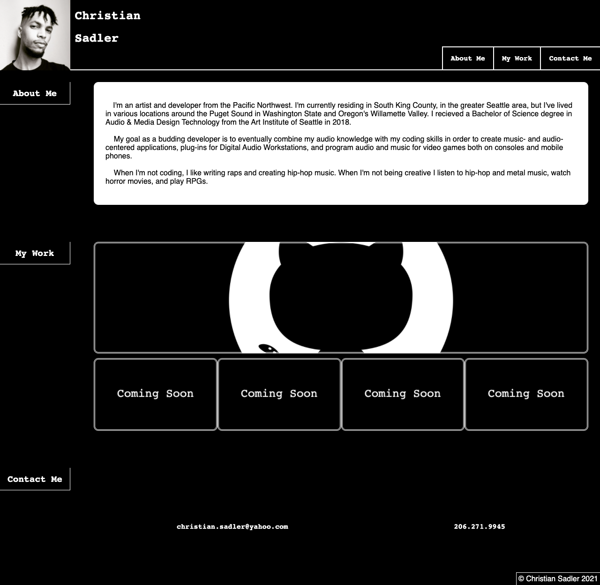
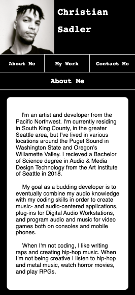

# Christian's Portfolio

## The run-down, basically:

I created a webpage from scratch to serve as my portfolio, showcasing the projects I've deployed and giving interested parties a way to learn about who I am, what I do, and how to contact me.

The main thing I focused on with this project was a dynamically changing layout dependent on screen size so the site displays correctly on mobile, desktop and everything in between. I achieved this using media queries in the CSS file.

As the screen size gets smaller, the nav bar shuffles under the constant header and the headings on the sidebar extend to become page breaks. The content cards in the My Work section rearrange, stretch, and grow accordingly to keep looking good no matter the device one is using to view the site.

---

## Screenshots:

### Desktop Preview

### Mobile Preview

---

##Links:

### [GitHub Repository](https://github.com/Chrisaeus/ChristianSadler-Portfolio)

### [Live Website](https://chrisaeus.github.io/ChristianSadler-Portfolio)